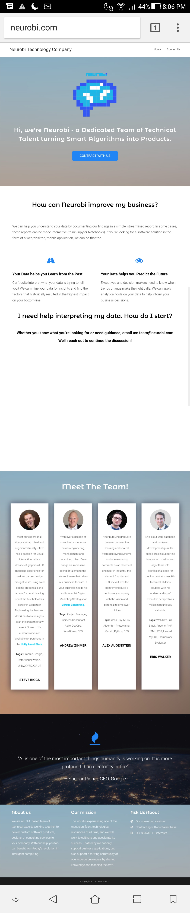

# UPDATE: We completed the migration from GoDaddy hosting to GitHub! See our new site at [neurobi.com](https://neurobi.com)! You can find all of the code that powers this website in the code repository you're looking at. This is live code (not a copy of the site code - it's the real deal).
## This site was migrated from WordPress so that we could manage clean, open-source code and share our approach on Github
## The code was structured modularly. It reflects our software engineering best-practices, and was commented appropriately with its intended use (on Github) as a learning resource.
### Special thanks to @prajwalsouza for posting his excellent Random-Triangle-Mesh-Generation repo! This was re-purposed to give our site some neat effects. The code has been modified and refactored to fit our use-case for this website, but the core algorithm is the same.
### For the sake of comparison, check out the below screenshot as to how our site used to look when it was hosted on WordPress: 
